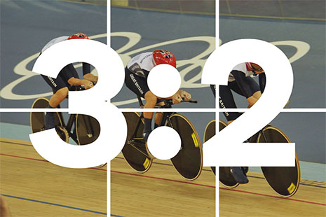

<!-- About this guide -->

  
Use this guide to help you make your service look consistent with the rest of GOV.UK.

1. **[Typography](#guide-typography)**
2. **[Grids](#guide-grid)**
3. **[Images](#guide-images)**
4. **[Data](#guide-data)**
5. **[Colour](#guide-colour)**
6. **[Forms](#guide-forms)**

<!-- Typography -->

  <h2 class="guide-header">1. Typography</h2>
  

    Services should use clear, easy to read type, with consistent styles and a clear hierarchy of information.
  

<!-- Typography : Start page titles -->

  <h3 class="guide-subheader">Page titles</h3>

  

    
    

      <h1>Driving and transport <em>48px</em></h1>
      

        Buy or renew your tax disc (vehicle licence) online - get tax for your car, motorbike, lorry, bus or other vehicle that needs a tax disc. <em>19px</em>
      

    

    
  

<!-- Typography : Page subtitles -->

  <h3 class="guide-subheader">Page subtitles</h3>

  

    
    

      <h2>
        Disability exemption <em>24px</em>
      </h2>
      

        You may be exempt or pay a reduced amount of vehicle tax if you receive certain benefits because of your disability. Find out if you’re eligible and how to apply. <em>19px</em>
      

    

    
  

<!-- Typography : Body copy -->

  <h3 class="guide-subheader">Body copy</h3>

  

    
    

      <h3>
        If you’re a motor trader. <em>19px</em>
      </h3>
      

        Motor traders don’t need to make a SORN on a vehicle if all the following apply: <em>19px</em> 
      

    

    
  

<!-- Typography : Spacing -->

  <h3 class="guide-subheader">Putting it all together</h3>
  

    To ensure text is easy to read, aim for 50-60 characters per line.
  

  

    
    

      <h1>
        Make a SORN (Statutory Off Road Notification) <em>48px</em>
      </h1>
      

        You can make a SORN (Statutory Off Road Notification) online if you are registered as the vehicle’s keeper. You’ll need the reference number on your V5C registration certificate, V11 or V85/1 reminder form. <em>19px</em>
      

      <h2>
        Penalties <em>24px</em>
      </h2>
      

        If you don’t make a SORN when you have to you’ll automatically be fined £80, will need to get a new tax disc and must pay any tax arrears. You could also get a County Court Judgement against you, be fined a minimum of £1,000 and be liable to prosecution. <em>19px</em>
      

      <h3> If you’re a motor trader. <em>19px</em></h3>

      

        Motor traders don’t need to make a SORN on a vehicle if all the following apply: <em>19px</em>
      

    

    
  

  

<!-- Typography : Get the styles -->

  <h3 class="guide-subheader">Get the styles</h3>
  

    Here's an example of the above <a href="{{ site.baseurl}}/example/typography.html">basic typography styles</a>. For more control over heading hierarchy, here's the same example <a href="{{ site.baseurl}}/example/typography-classnames.html">using classnames</a>. We're also using a <code>.text</code> class to wrap text blocks, setting a maximum width and to prevent lines from getting too long.
  

<!-- Grid -->

  <h2 class="guide-header">2. Grids</h2>
  

    Tablet or desktop layouts use either a three or four column fluid grid. 
  

<!-- Grid : Example -->

  <h3 class="guide-subheader">Two columns</h3>

  

    

      

        
Content

      

    

    

      

        
Content

      

    

  

<!-- Grid : Example -->

  <h3 class="guide-subheader">Three equal columns</h3>

  

    

      

        
Content

      

    

    

      

        
Content

      

    

    

      

        
Content

      

    

  

<!-- Grid : Example -->

  <h3 class="guide-subheader">Four equal columns</h3>

  

    

      

        
Content

      

    

    

      

        
Content

      

    

    

      

        
Content

      

    

    

      

        
Content

      

    

  

<!-- Grid : Get the styles -->

  <h3 class="guide-subheader">Get the styles</h3>
  

    Here's an example of the above <a href="{{ site.baseurl}}/example/grid.html">grid layout</a>. Use this example to get started structuring your page content.
  

<!-- Images -->

  <h2 class="guide-header">3. Images</h2>
  

    Avoid using images, GOV.UK is for services and information, not photographs. If images cannot be avoided they should be landscape, 3:2 aspect ratio.
  

<!-- Images : Example -->

  

    

      

        
      

    

    

      

        
      

    

  

<!-- Data -->

  <h2 class="guide-header">4. Data</h2>
  

    Data is recommended as an alternative to using photography.
  

<!-- Data : Example -->

  

    

      
      

        <h2 class="data-80">24</h2>
        
Ministerial departments

      

      
    

  

  

    

      
      

        <h2 class="data-80">80px</h2>
        
16px

      

      
    

  

<!-- Data : Example -->

  

    

      
      

        <h2 class="data-48">56/154</h2>
        
on GOV.UK

      

      
    

  

  

    

      
      

        <h2 class="data-48">48px</h2>
        
16px

      

      
    

  

<!-- Colour palette -->

  <h2 class="guide-header">5. Colour</h2>
  

    The GOV.UK Service Design Manual shows HEX values and Sass variable names for the <a href="https://www.gov.uk/service-manual/user-centered-design/resources/colour-palettes.html">GOV.UK colour palette</a>. Using the Sass variables in the GOV.UK frontend toolkit is recommended, in case these colours are updated. 
  

<!-- Colour palette : Example -->

  

    

      <a href="#">Link colour</a>
    

    <code>
      HEX: #2e3191  
      Sass variable: $link-colour
    </code>
    

      Secondary text colour
    

    <code>
      HEX: #6F777B  
      Sass variable: $secondary-text-colour
    </code>
    
    

    

    
    <code>
      HM Government  
      HEX: #0076c0  
      Sass: $hm-government
    </code>
  

<!-- Buttons -->

  <h2 class="guide-header">6. Buttons</h2>
  

    Primary action buttons are green, secondary action buttons are grey, irreversible action buttons are red.
  

<!-- Buttons : Example-->

  

    <a href="#" class="button">Primary action</a>
    <a href="#" class="button button-secondary">Secondary action</a>
    <a href="#" class="button button-warning">Warning action</a>
  

<!-- Buttons : Get the styles -->

  <h3 class="guide-subheader">Get the styles</h3>
  

    Here's an <a href="{{ site.baseurl}}/example/form.html">example form using the button styles</a>.
  

