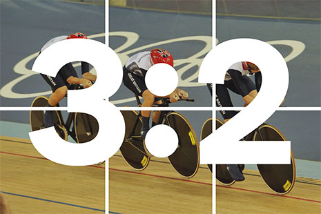

  
This guide explains how to make your service look consistent with the rest of GOV.UK.
    For advice on how best to implement this style guide, <a href="../example/">see the examples page</a>.

1. **[Typography](#guide-typography)**
2. **[Grids](#guide-grid)**
3. **[Images](#guide-images)**
4. **[Data](#guide-data)**
5. **[Colour](#guide-colour)**
5. **[Forms](#guide-forms)**

<!-- Typography -->

  <h2 class="heading-36">1. Typography</h2>
  

    The GOV.UK design is mostly about the typography. Tell people what they need to do, in words that they understand. Make the words big enough so they are comfortable to read.
  

  

    GOV.UK uses the typeface New Transport, an update of Transport which was designed in the late fifties/early sixties for for Britain’s national motorway and road sign system. It's designed to be highly legible in all sorts of extreme conditions; in the rain, at night, at speed. Read more about it on <a href="https://gds.blog.gov.uk/2012/07/05/a-few-notes-on-typography/">Ben's blog post</a>.
  

<!-- Typography : Body copy -->

  <h3 class="heading-24">Body copy</h3>

  

    
    

      <h4 class="heading-19">
        If you’re a motor trader. <em class="highlight">19px</em>
      </h4>
      

        Motor traders don’t need to make a SORN on a vehicle if all the following apply: <em class="highlight">19px</em> 
      

    

    
  

  

    Body copy is the main content of your web page. In most cases we'd advise:
  

  <ul>
    <li>the body copy should be the main focus of the page. on desktop computers that means 66.6% page width or wider</li>
    <li>use the 19px font size for paragraph and caption text</li>
    <li>try to keep line lengths beneath about 75 characters</li>
  </ul>

<!-- Typography : Page titles -->

  <h3 class="heading-24">Page titles</h3>

  

    
    

      <h1 class="heading-48">Driving and transport <em class="highlight">48px</em></h1>
      

        Buy or renew your tax disc (vehicle licence) online - get tax for your car, motorbike, lorry, bus or other vehicle that needs a tax disc. <em class="highlight">19px</em>
      

    

    
  

<!-- Typography : Page subtitles -->

  <h3 class="heading-24">Page subtitles</h3>

  

    
    

      <h2 class="heading-36">
        Disability exemption <em class="highlight">36px</em>
      </h2>
      

        You may be exempt or pay a reduced amount of vehicle tax if you receive certain benefits because of your disability. Find out if you’re eligible and how to apply. <em class="highlight">19px</em>
      

      
      <h3 class="heading-24">
        Disability exemption <em class="highlight">24px</em>
      </h3>
      

        You may be exempt or pay a reduced amount of vehicle tax if you receive certain benefits because of your disability. Find out if you’re eligible and how to apply. <em class="highlight">19px</em>
      

      
    

    
  

<!-- Typography :  -->

  <h3 class="heading-24">Take a look at the examples</h3>
  

    Here's an example showing the <a href="{{ site.baseurl}}/example/typography.html">basic typography styles</a>.
  

  

    We're also using a <code>.text</code> class to wrap text blocks, setting a maximum width to prevent lines from getting too long.
  

<!-- Grid -->

  <h2 class="heading-36">2. Grids</h2>
  

    Tablet or desktop layouts use either a three or four column fluid grid. 
  

<!-- Grid : Example -->

  <h3 class="heading-24">Two columns</h3>

  

    

      

        
Content

      

    

    

      

        
Content

      

    

  

<!-- Grid : Example -->

  <h3 class="heading-24">Three equal columns</h3>

  

    

      

        
Content

      

    

    

      

        
Content

      

    

    

      

        
Content

      

    

  

<!-- Grid : Example -->

  <h3 class="heading-24">Four equal columns</h3>

  

    

      

        
Content

      

    

    

      

        
Content

      

    

    

      

        
Content

      

    

    

      

        
Content

      

    

  

<!-- Grid : Take a look at the examples -->

  <h3 class="heading-24">Take a look at the examples</h3>
  

    Here's a page which shows how to create the above <a href="{{ site.baseurl}}/example/grid.html">grid layout</a>. Use this example to get started structuring your page content.
  

<!-- Images -->

  <h2 class="heading-36">3. Images</h2>
  

    Avoid using images, GOV.UK is for services and information, not photographs. If images cannot be avoided they should be landscape, 3:2 aspect ratio.
  

<!-- Images : Example -->

  

    

      

        
      

    

    

      

        
      

    

  

<!-- Data -->

  <h2 class="heading-36">4. Data</h2>
  

    Data is recommended as an alternative to using photography.
  

<!-- Data : Example -->

  

    

      
      

        <h2 class="data-80">24</h2>
        
Ministerial departments

      

      
    

  

  

    

      
      

        <h2 class="data-80">80px</h2>
        
16px

      

      
    

  

<!-- Data : Example -->

  

    

      
      

        <h2 class="data-48">56/154</h2>
        
on GOV.UK

      

      
    

  

  

    

      
      

        <h2 class="data-48">48px</h2>
        
16px

      

      
    

  

<!-- Colour palette -->

  <h2 class="heading-36">5. Colour</h2>
  

    Text should only be set in black with secondary text in grey. Links should be blue and buttons or dialog boxes should have text in white.
  

  

     The GOV.UK Service Design Manual shows HEX values and Sass variable names for the <a href="https://www.gov.uk/service-manual/user-centered-design/resources/colour-palettes.html">GOV.UK colour palette</a>. You can find Sass variables for the GOV.UK colour palette in the <a href="https://github.com/alphagov/govuk_frontend_toolkit#colours">GOV.UK front end toolkit</a>.
   

<!-- Colour palette : Example -->

  

    

      <a href="#">Link colour</a>
    

    <code>
      HEX: #2e3191  
      Sass variable: $link-colour
    </code>
    

      Secondary text colour
    

    <code>
      HEX: #6F777B  
      Sass variable: $secondary-text-colour
    </code>
    

    

    <code>
      HM Government  
      HEX: #0076c0  
      Sass: $hm-government
    </code>
  

<!-- Forms -->

  <h2 class="heading-36">6. Forms</h2>
  
As explained in their <a href="http://www.w3.org/TR/html51/forms.html#the-fieldset-element">HTML5 specification section</a> fieldsets are used to break up forms into logical sections.

  <h3 class="heading-24">Labels</h3>
  

    By default labels should be aligned above their controls.
  

<!-- Forms : Example-->

  

    <form action="get" class="form">
      <fieldset>
        

          <label for="">Full name</label>
          <input type="text" class="form-control" />
        

      </fieldset>
    </form>
  

  <h3 class="heading-24">Buttons</h3>
  

     Buttons use the button mixin defined in the <a href="https://github.com/alphagov/govuk_frontend_toolkit#buttons">GOV.UK front end toolkit</a>. 
  

  <h4 class="heading-19">Changing the secondary grey button style</h4>
  

    The grey button has a couple of issues - when positioned next to our primary green button some users assume that the grey means the button is disabled. 

    To others, it looks more like a default OS button than the green one, which can be confusing.
  

  

    To remove this confusion, we're changing the grey button to look like a link, but with appropriate whitespace so that it can be positioned consistently alongside the primary green buttons.
  

  

    Yellow focus states for all buttons are also shown.
  

<!-- Buttons : Example-->

  

    <button class="button">Primary button</button>
    <button class="button-link">Secondary button</button>
    <a class="button-link" href="{{ site.baseurl}}/example/form.html">Link</a>
  

<!-- Forms : Take a look at the examples -->

  <h3 class="heading-24">Take a look at the examples</h3>
  

      Here's an <a href="{{ site.baseurl}}/example/form.html">example form</a>.
  

